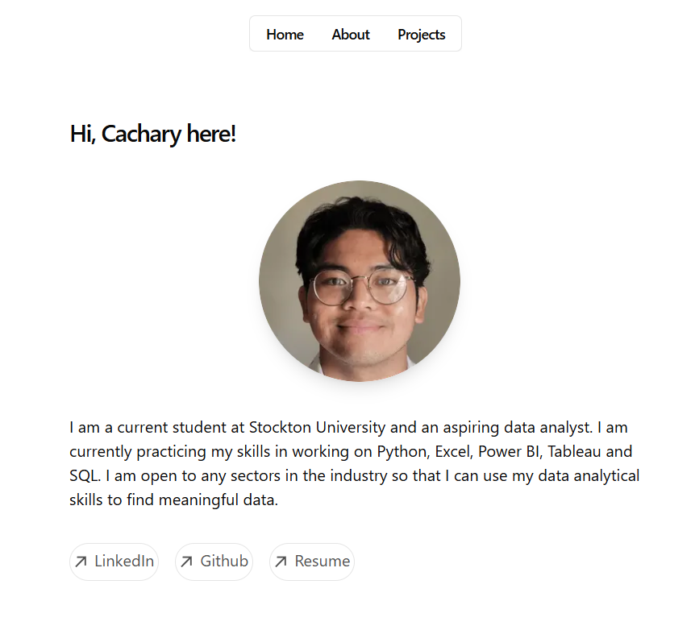

# Cachary's Portfolio Website

## Description

This website contains all of Cachary's Portfolio ranging from **Education**, **Skills**, **Projects**, and **Experience**.
This website was made using NextJS Framework alongside Tailwind CSS for styling.

## Getting Started

Find my website at [cachary.vercel.app]

## Authors

Contributors names and contact info

1. Cachary Tolentino

## Version History

* 0.1
    * Implemented initial portfolio information

## License

This project is licensed under the MIT License - see the LICENSE.md file for details